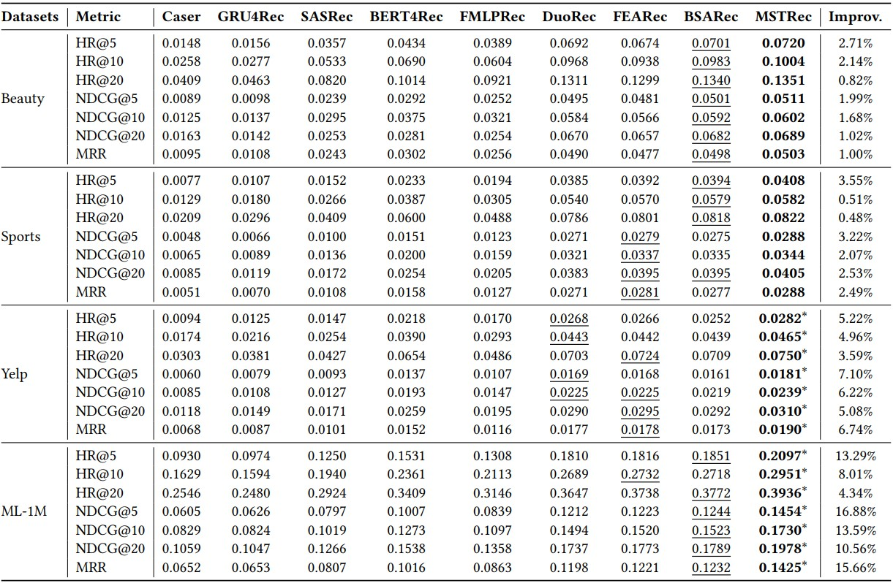

# MSTRec


This is the source code for our Paper 'Contrastive Enhanced Multi-Scale Transformer for Sequential Recommendation'


# Overview
MSTRec is a Transformer architecture, wherein each block starts with a multi-scale attention encoder and ends with a feed-forward layer.  The core module of our MSTRec is the multi-scale attention encoder, which enables the model to present multi-scale periodic patterns adaptively and capture multi-scale periodic patterns explicitly. Essentially, we enhance the original self attention with multi-scale attention projection, thereby extending the Transformer's capability to capture key dynamics with different periodic patterns.  


# Datasets
We utilize four benchmark datasets to evaluate our MSTRec, all of which can be downloaded in [Google Drive](https://drive.google.com/drive/folders/1Ir0nVoC_1flw3zW9N_ANck_XaGTvCNTa): 
* Amazon Beauty, Sports are two representative sub-datasets gathered from Amazon dataset, which contains a series of product reviews crawled from Amazon.com. They are split by the top-level product categories on Amazon, we adopt the “Beauty”, “Sports and Outdoors (Sports)” categories.
* ML-1M is a large and dense dataset with long item sequences, which collected from the movie recommendation site MovieLens. 
* Yelp is a large business recommendation dataset. We treat the transaction records after $\text{January}$ $1 ^ {st}$,  $2019$.
* Note that the `*_same_target.npy` files in [Google Drive link](https://drive.google.com/drive/folders/1Ir0nVoC_1flw3zW9N_ANck_XaGTvCNTa) for the four datasets are utilized for training DuoRec, FEARec and our MSTRec, both of which incorporate contrastive learning.


# Environment Setting
 ```
conda create -n MSTRec python=3.8
conda activate MSTRec
 ```
The required environment settings are detailed in the `requirements.txt` file.


# Quick-Start

## How to train MSTRec
If you have downloaded the source codes, you can just `run main.py` train the model：
 ```
python main.py  --data_name [DATASET] \
                 --lr [LEARNING_RATE] \
                 --scale_K [K] \ 
                 --num_attention_heads [N_HEADS] \
                 --hidden_dropout_prob [DROPOUT] \
                 --train_name [LOG_NAME]
 ```
 `train_name`： name for log file and checkpoint file.


Example for Beauty
 ```
python main.py  --data_name Beauty \
                 --lr  0.001\
                 --scale_K 3 \ 
                 --num_attention_heads 2 \
                 --hidden_dropout_prob 0.5 \
                 --train_name MSTRec_Beauty
 ```


* Note that trained model (.pt) and train log file (.log) will saved in  `src/output` folder.
* The parameters of our model with contrastive learning remain the same as those of the baselines DuoRec.


## How to test MSTRec
If you have trained MSTRec on a certain dataset, you can test the trained model：
 ```
python main.py  --data_name [DATASET] \
                 --scale_K [K] \ 
                 --num_attention_heads [N_HEADS] \
                 --load_model [TRAINED_MODEL_NAME] \
                 --do_eval
 ```

* Note that trained model (.pt) must be in `src/output`： name for log file and checkpoint file
* `load_model`:  trained model name without .pt

Example for Beauty
 ```
python main.py  --data_name Beauty \
                 --scale_K 3 \ 
                 --num_attention_heads 2 \
                 --load_model MSTRec_Beauty \
                 --do_eval
 ```


# Performance Comparison 
We illustrate the performance of our MSTRec model comparing with eight state-of-the-art baselines on four datasets. The best performance methods are in boldface, and the second best methods are underlined. $^*$ denotes the improvement is significant with $p$ -value < 0.05.



We search the optimal hyperparameters for all baselines based on their recommended hyperparameters. It is worth noting that the results  reported in the paper BSARec on the benchmark datasets are generally superior to those of our MSTRec. This can be attributed to the following reasons: (1) BSARec reports the best performance achieved on each dataset, whereas we report the average performance over five runs with different random seeds; and (2) the discrepancies may also stem from differences in experimental environments.


# Hyperparameter Setting
The key hyperparameter of our model is the scale $𝐾$, which represents the $𝐾$ selected periodic scales corresponding to the $𝐾$ most significant frequencies in the frequency domain of the user behavior sequence. The optimal performance is achieved at different scales $𝐾$ across the four datasets: $𝐾$ = 3 for Beauty, $𝐾$ = 5 for both Sports and Yelp, and $𝐾$ = 4 for ML-1M.

<div align="center">
  
</div>

Overall, different datasets exhibit varying sensitivity to the scale $𝐾$, and increasing scale $𝐾$ does not necessarily improve the model performance, which may be atttibuted to the differences in the periodic trends of user behavior characteristics across datasets.  


# Performance under Different Setting
We also conduct experiments on four datasets under another evaluation strategy to further validate the performance of our MSTRec. Specifically, we pair the ground-truth item with 99 randomly sampled negative items that the user has not interacted with. We then evaluate our MSTRec model without using contrastive learning, maintaining the same scale $K$ as in the main experiment for each dataset. Finally, we select two Transformer-based models SASRec and FMLPRec, as representative baselines. 

<div align="center">
  
</div>

Experimental results demonstrate that our proposed multi-scale attention encoder effectively enhances the Transformer’s ability to capture key dynamics (periodic patterns).


