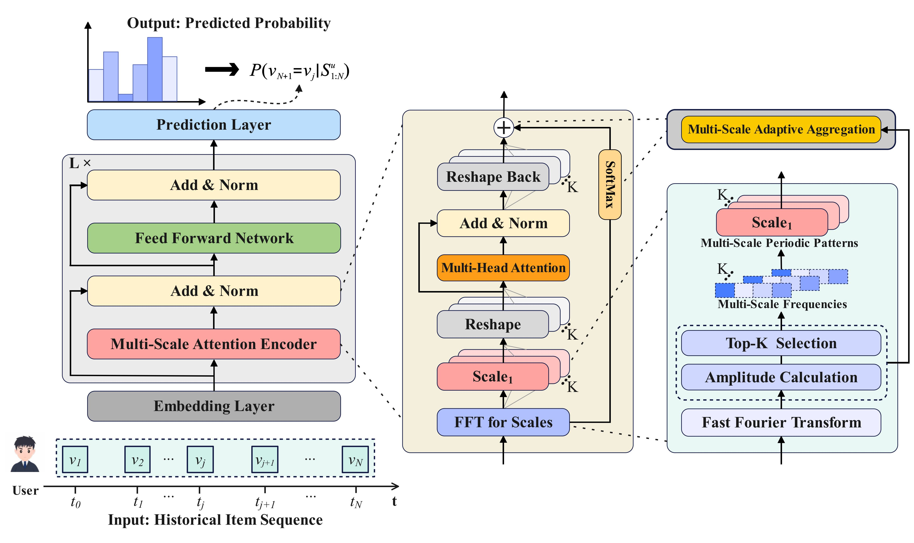

# MSTRec

This is the source code for our Paper 'Contrastive Enhanced Multi-Scale Transformer for Sequential
Recommendation'

# Overview
MSTRec is a Transformer architecture, wherein each block starts with a multi-scale attention encoder and ends with a feed-forward layer.  The core module of our MSTRec is the multi-scale attention encoder, which enables the model to present multi-scale periodic patterns adaptively and capture multi-scale periodic patterns explicitly. Essentially, we enhance the original self-attention with multi-scale attention projection, thereby extending the Transformer's capability to capture key dynamics with different periodic patterns.  

